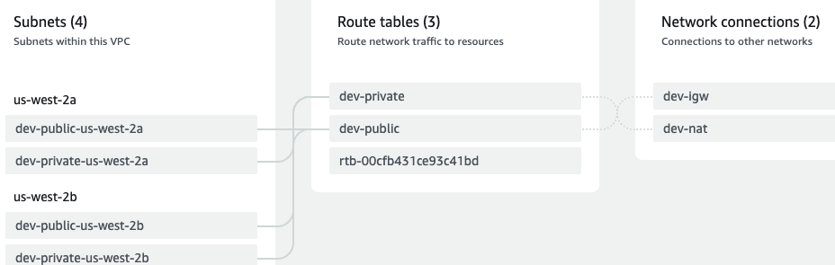

# template based on Anton Putra tutorial
## infrastructure-live-v1
### set region to us-west-2
- `echo $AWS_REGION`
- `export AWS_REGION=us-west-2`
### stage the code
- `cd eks`
- `mkdir -p dev staging`
- `cd dev`
### desgin
```
❯ tree
.
├── README.md
├── demo
├── dev
│   └── vpc
│       ├── 0-provider.tf
│       ├── 1-vpc.tf
│       ├── 2-igw.tf
│       ├── 3-subnets.tf
│       ├── 4-nat.tf
│       ├── 5-routes.tf
│       └── 6-outputs.tf
└── staging
```

### deployment
- `cd dev/vpc`
- `t init`
### VPC diagram
- 

## infrastructure-live-v2
- modularize the code
- observe that the "region" setting is not in any of the base .tf files
- "provider" and "backend" will be managed in the "infrastructure-live-v2" directory
- if there is no more descriptive name available or if the resource only creates 1 instance fo this type, it is a Terraform convention to call the resource "this"
### design
```
├── infrastructure-live-v2
│   ├── dev
│   │   └── vpc
│   │       ├── main.tf
│   │       └── outputs.tf
│   └── staging
├── infrastructure-live-v3
├── infrastructure-live-v4
└── infrastructure-modules
    └── vpc
        ├── 0-versions.tf
        ├── 1-vpc.tf
        ├── 2-igw.tf
        ├── 3-subnets.tf
        ├── 4-nat.tf
        ├── 5-routes.tf
        ├── 6-outputs.tf
        └── 7-variables.tf
```

### deployment
- `cd infrastructure-live-v2/dev/vpc`
- `t init`
- `t plan`
- `t apply`
- `t destroy`


## infrastructure-live-v3
- use terragrunt for orchestration
- terragrunt uses an inputs block to pass variables to a module
```
inputs = {
  env             = "dev"

}
```

### design
```
├── infrastructure-live-v3
│   ├── dev
│   │   └── vpc
│   │       └── terragrunt.hcl
│   ├── staging
│   │   └── vpc
│   └── terragrunt.hcl
├── infrastructure-live-v4
└── infrastructure-modules
    └── vpc
        ├── 0-versions.tf
        ├── 1-vpc.tf
        ├── 2-igw.tf
        ├── 3-subnets.tf
        ├── 4-nat.tf
        ├── 5-routes.tf
        ├── 6-outputs.tf
        └── 7-variables.tf
```
- top-level orchestration
- `terragrunt run-all destroy` from root folder
```
❯ tree
.
├── backend.tf
├── dev
│   ├── plans
│   │   └── plan01.cfg
│   └── vpc
│       └── terragrunt.hcl
├── provider.tf
├── staging
│   └── vpc
│       └── terragrunt.hcl
└── terragrunt.hcl
```
### deployment
- `cd infrastructure-live-v3/dev/vpc`
- `terragrunt init`
- `t plan`
- `t apply`
- `t destroy`
## infrastructure-live-v4
### eks cluster
- node type: `aws ec2 describe-instance-types --region us-west-2 --query 'InstanceTypes[*].InstanceType' --output table`
- **t2.micro**
- eks requires subnets in at least two availability zones
- before we can setup the EKS control plane, we need to create an IAM role with EKS principal
- attach the AWS EKS cluster policy to the role
  + allows EKS to create EC2 instances and load balancers
- attach the IAM role to the cluster
- cluster scale
  + all node groups must be attached to the EKS cluster
  + the same IAM role can be shared among all node groups
  + to grant additional access for applications in your cluster that want to access the AWS API, we will use an OpenID Connect provider.
  + `to enable true autoscaling, we must enable cluster autoscaler or use Karpenter`
- irsa:  for openID connect we must retrieve the TLS certificate for the cluster 
  + to deploy the cluster autoscaler, we will need to use the *OpenID provider ARN* to establish trust between the AWS IAM and the Kubernetes service account
### terragrunt
- the top-level terragrunt.hcl file *defines shared objects between environments and modules*
- the `dev` directory has an `env.hcl` (terragrunt) file for common variables onlly for this development environment


### design
```
── infrastructure-live-v4
│   ├── dev
│   │   ├── eks
│   │   │   └── terragrunt.hcl
│   │   ├── env.hcl
│   │   └── vpc
│   │       └── terragrunt.hcl
│   ├── staging
│   └── terragrunt.hcl
└── infrastructure-modules
    ├── eks
    │   ├── 0-versions.tf
    │   ├── 1-eks.tf
    │   ├── 2-nodes-iam.tf
    │   ├── 3-nodes.tf
    │   ├── 4-irsa.tf
    │   ├── 5-outputs.tf
    │   └── 6-variables.tf
    └── vpc
        ├── 0-versions.tf
        ├── 1-vpc.tf
        ├── 2-igw.tf
        ├── 3-subnets.tf
        ├── 4-nat.tf
        ├── 5-routes.tf
        ├── 6-outputs.tf
        └── 7-variables.tf
```

### deployment
- `cd infrastructure-live-v4/dev`
- `terragrunt run-all init`
- `terragrunt run-all plan`


## 2023-09-24 21:01:13
- video: 40:55
- have not applied to us-west-2
- commit msg:  "plan-base-eks-us-west-2"


## 2023-09-27 06:15:24

### deployment (cont'd)
- `cd infrastructure-live-v4/dev`
- `terragrunt run-all init`
- `terragrunt run-all apply`
- note that terragrunt will determine the correct order to apply the plan:
```
Group 1
- Module /Users/robert/go/src/github.com/aws-sol-arch-2023/eks/infrastructure-live-v4/dev/vpc

Group 2
- Module /Users/robert/go/src/github.com/aws-sol-arch-2023/eks/infrastructure-live-v4/dev/eks
```

### cluster verification: update kubectl
- `export AWS_REGION=us-west-2`
- `aws eks list-clusters`
- `aws eks update-kubeconfig --name dev-demo --region us-west-2`
- `k config get-contexts`
- `k get nodes`


### kubernetes addons
- create a separate module to deploy k8s addons

#### all kubernetes addons will have a flag to enable them
- this will be a boolean count value: if it's "true" the count is one
- 1-cluster-autoscaler.tf
- eks name will be used as a prefix for the IAM role
#### Helm Charts will be the preferred mechanism to deploy complex applications like Prometheus
- the Helm provider needs to be authenticated
- we will generate the Helm authentication via Terragrunt
- to initialize the Helm provider, we need to generate a temporary token
- you can pretty much initialize any provider that needs to authenticate to EKS using the same principle
#### cluster autosclaer
- the cluster needs access to the AWS API in order to discover autoscaling groups and to adjust the desired size settings of them
- for this we need to use IAM Roles for Service Accounts (IRSA)
- the IRSA for the autoscaler will happen in the `kube-system` namesapce
- the kubernetes service account name is "cluster-autoscaler"
- we create a policy that allows the autoscaler access and then attach the policy to the IAM role

#### deployment
- `cd infrastructure-live-v4/dev`
```
❯ tree
.
├── eks
│   └── terragrunt.hcl
├── env.hcl
├── kubernetes-addons
│   └── terragrunt.hcl
├── plans
│   └── plan01.cfg
└── vpc
    └── terragrunt.hcl
```
- `terragrunt run-all plan`

#### checkout
- `helm list -A`
```
helm list -A
NAME            NAMESPACE       REVISION        UPDATED                                 STATUS          CHART                           APP VERSION
autoscaler      kube-system     1               2023-09-27 07:34:44.477254 -0500 CDT    deployed        cluster-autoscaler-9.28.0       1.26.2 
```
- `k get pods -n kube-system`
  + look for autoscaler pod

#### demo deployment
- **requests** are what the container gets guaranteed, and **imits** are the maximum resources that the container can use. 
- For a lightweight demo application, you could significantly lower the resources:
```
resources:
  requests:
    memory: "64Mi"
    cpu: "100m" # 100 milliCPU units
  limits:
    memory: "128Mi"
    cpu: "200m" # 200 milliCPU units
```
- `k apply -f deployment.yml`

### cluster retirement
- `cd infrastructure-live4/dev`
- `terragrunt run-all destroy`